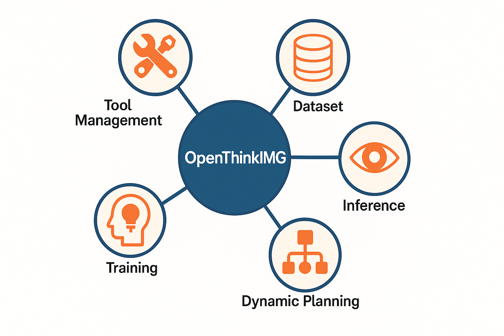

# OpenThinkIMG

> **Empowering vision-driven reasoning through modular tool orchestration**
>
> OpenThinkIMG is an end-to-end framework for building multimodal agents that seamlessly integrate vision tools to analyze, interpret, and reason over images. From dynamic tool management to unified training via SFT and RL, OpenThinkIMG accelerates development of robust, adaptable vision-enhanced AI systems.

<figure style="text-align: center;">
  
  <figcaption>
    Supported Features by OpenThinkIMG
  </figcaption>
</figure>


 📚 [Documentation](docs/README.md)

## 🔔 News

- **[2025-04]** We release **OpenThinkIMG**, the first **end-to-end multimodal reasoning framework** over images, featuring:
  - 🔧 Flexible vision tool management
  - 🧩 Easy integration of new tools
  - ⚡ Dynamic inference and planning
  - 🧠 Unified training via SFT & RL
  


## 📌 Overview

**OpenThinkIMG** is designed for building and training **multimodal agents** that can **reason over images via vision tools**. It includes two core components:

- **🔌 Tool Deployment Framework**: A modular system to run and serve vision tools in isolated environments.

- **🧠 Training Framework (SFT + RL)**: A pipeline to teach models how to use tools through **supervised fine-tuning (SFT)** and **reinforcement learning**.

## ⚙️ Installation

We provide a general setup that works across most tools. Individual tools may have specific requirements (to be released separately).

```bash
# Clone the repository
git clone git@github.com:zhaochen0110/Tool-Factory.git
cd Tool-Factory

# [Optional] Create a clean Conda environment
conda create -n tool-server python=3.10
conda activate tool-server

# Install PyTorch and dependencies (make sure CUDA version matches)
conda install pytorch==2.0.1 torchvision==0.15.2 torchaudio==2.0.2 pytorch-cuda=11.8 -c pytorch -c nvidia

# Install remaining dependencies
pip install -r requirements.txt
pip install -e .
```
> 💡 Note: The `requirements.txt` is tailored for inference & evaluation. For training, refer to the [Training Section](https://github.com/SalesforceAIResearch/TACO#training) for additional dependencies.

If you encounter issues, check out our [📄 Documentation](docs/README.md).


## 🚀 Quick Start

### 🔌 Step 1: Launch Vision Tool Services

To enable tool-enhanced inference, start all vision tools before using the inferencer. Each tool runs independently and is launched via a unified config.

```bash
## First, modify the config to adapt to your own environment
## tool_server/tool_workers/scripts/launch_scripts/config/all_service_szc.yaml

## Start all services
cd tool_server/tool_workers/scripts/launch_scripts
python start_server_config.py --config ./config/all_service.yaml

## Press control + C to shutdown all services automatically.
```

### 🔍 Step 2: Run Inference with OpenThinkIMG

#### ✅ Option 1: Direct Evaluation (e.g., Qwen2VL on ChartGemma)

```bash
accelerate launch  --config_file  ${accelerate_config} \
-m tool_server.tf_eval \
--model qwen2vl \
--model_args pretrained=Qwen/Qwen2-VL-7B-Instruct \
--task_name chartgemma \
--verbosity INFO \
--output_path ./tool_server/tf_eval/scripts/logs/results/chartgemma/qwen2vl.jsonl \
--batch_size 2 \
--max_rounds 3 \
--stop_token <stop> 
```

#### 🧩 Option 2: Evaluation via Config File (Recommended)


```bash
accelerate launch  --config_file  ${accelerate_config} \
-m tool_server.tf_eval \
--config ${config_file}
```

#### Config file example:

```yaml
- model_args:
    model: qwen2vl
    model_args: pretrained=Qwen/Qwen2-VL-7B-Instruct
    batch_size: 2
    max_rounds: 3
    stop_token: <stop>
  task_args:
    task_name: chartgemma
    resume_from_ckpt:
      chartgemma: ./tool_server/tf_eval/scripts/logs/ckpt/chartgemma/qwen2vl.jsonl
    save_to_ckpt:
      chartgemma: ./tool_server/tf_eval/scripts/logs/ckpt/chartgemma/qwen2vl.jsonl
  script_args:
    verbosity: INFO
    output_path: ./tool_server/tf_eval/scripts/logs/results/chartgemma/qwen2vl.jsonl
```

For detailed information and config setting please refer to our [documentation](docs/README.md).


## 🧠 Training

Once the vision tools are properly deployed, we provide a flexible training pipeline to teach models **how to plan and invoke tools** effectively through **SFT** and **RL-based (GRPO)** methods.

Our training pipeline builds on the solid foundation of [OpenR1](https://github.com/OpenR1), integrating visual tools as external reasoning capabilities.

### 📦 Install Additional Dependencies

To run training code, make sure to install the additional required packages:

```
pip install -r requirements_train.txt
```

### 🔁 Reinforcement Learning with Vision Tools

We provide a customized implementation of **GRPO** for training models to leverage vision tools dynamically in complex tasks.

```
torchrun --nproc_per_node=${nproc_per_node} \
    --nnodes="1" \
    --node_rank="0" \
    --master_addr="127.0.0.1" \
    --master_port=${master_port} \
    src/open_r1/tool_grpo.py --use_vllm True \
    --output_dir /mnt/petrelfs/share_data/suzhaochen/r1/R1-V-tool/R1-V/src/output_path/$RUN_NAME \
    --model_name_or_path ${model_path} \
    --dataset_name ${data_path} \
    --max_prompt_length 16000 \
    --max_completion_length 2048 \
    --temperature 1.0 \
    --seed 42 \
    --learning_rate 1e-6 \
    --num_generations 8 \
    --lr_scheduler_type "constant" \
    --vllm_gpu_memory_utilization 0.8 \
    --deepspeed ${DS_CONFIG} \
    --per_device_train_batch_size 2 \
    --gradient_accumulation_steps 12 \
    --logging_steps 1 \
    --bf16 true \
    --report_to wandb \
    --gradient_checkpointing true \
    --attn_implementation flash_attention_2 \
    --max_pixels 200000 \
    --num_train_epochs 1 \
    --run_name $RUN_NAME \
    --save_steps 100 \
    --save_only_model true \
    --controller_addr http://SH-IDCA1404-10-140-54-15:20001 \
    --use_tool true
```

> 📈  This helps the model learn **dynamic planning & tool invocation** using environment feedback.

### 🧪 SFT: Supervised Fine-Tuning

We also support supervised fine-tuning for training models on curated tool usage demonstrations. Modify the config according to your use case:

```
    accelerate launch --num_machines 1 --num_processes 6 --main_process_port 29502 --multi_gpu\
    src/open_r1/sft.py \
    --output_dir /mnt/petrelfs/share_data/suzhaochen/r1/R1-V-tool/R1-V/src/output_path/$RUN_NAME \
    --model_name_or_path ${model_path} \
    --dataset_name ${data_path} \
    --seed 42 \
    --learning_rate 2e-5 \
    --max_seq_length 4096 \
    --deepspeed config/deepspeed/ds_z3_offload_config.json \
    --per_device_train_batch_size 2 \
    --gradient_accumulation_steps 8 \
    --logging_steps 1 \
    --report_to wandb \
    --gradient_checkpointing true \
    --attn_implementation flash_attention_2 \
    --bf16 \
    --num_train_epochs 2 \
    --run_name $RUN_NAME \
    --save_steps 100 \
    --warmup_ratio 0.1 \
    --save_only_model true
```


## 📊 Experimental Results

To thoroughly assess the effectiveness of our vision tool–enhanced multimodal framework, we constructed a dataset of 14,501 chart‐reasoning examples for reinforcement learning. Starting from the SFT‑fine‑tuned model, we then performed RL training—achieving convergence in just 200 steps. Below are the comparative results against various baseline models:

| Model              | Score (%) |
| ------------------ | --------- |
| **Gemini**         | 61.5      |
| **GPT-4o**         | 51.0      |
| **Our Model**      | **43.2**  |
| Qwen-2VL (RL-Zero) | 31.5      |
| Qwen-2VL           | 29.5      |
| TACO-8B            | 30.5      |
| CogCom-13B         | 15.07     |

#### 🔍 Highlights

- ✅ Outperforms **Qwen-2VL** baseline by **+13.7%** and **TACO-8B** by **+12.7%**
- 🔁 Improves over the same base model trained from scratch by **+11.7%**
- ⚖️ Competitive with state-of-the-art commercial models while being fully open-source

---

## 📂 Examples & Case Studies

- **Zoom + OCR:** automatic zoom-in and OCR extraction on charts.


- **Point + DrawLine:** interactive annotation and drawing tools.

### 


## 🤝 Contributing

We welcome contributions of all kinds! In our [Documentation](docs/README.md) you’ll find detailed guides for:

- Importing custom models  
- Defining and integrating new vision tools  
- Extending the training pipeline  

To contribute:

1. **Fork** the repository and create a feature branch (e.g., `feature/new-vision-tool`).  
2. **Implement** your changes, adding or updating tests under `tests/`.  
4. **Submit** a pull request referencing the relevant issue, with clear descriptions and code snippets.  

---

## Citation

Please cite the following if you find OpenThinkIMG helpful:

```

@misc{OpenThinkIMG,
  author       = {OpenThinkIMG Team},
  title        = {OpenThinkIMG: Empowering vision-driven reasoning through modular tool orchestration},
  year         = {2025},
  organization = {GitHub},
  url          = {https://github.com/zhaochen0110/Tool-Factory},
}
```


