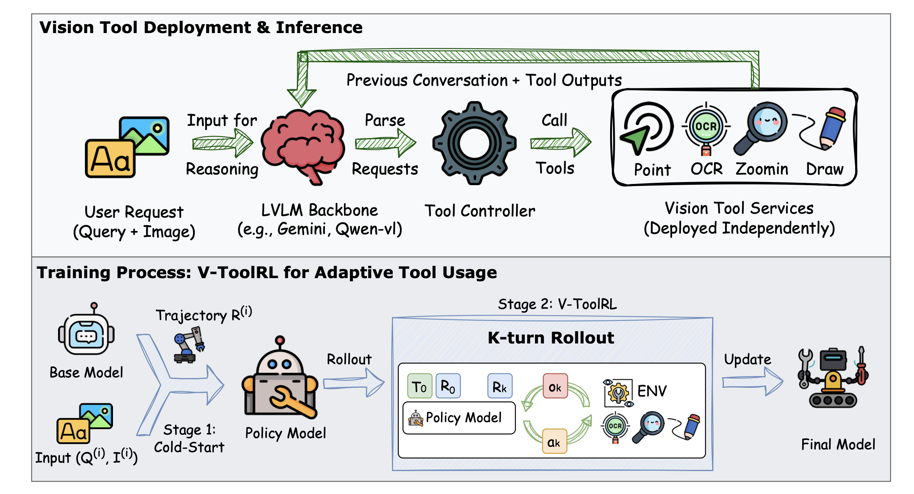
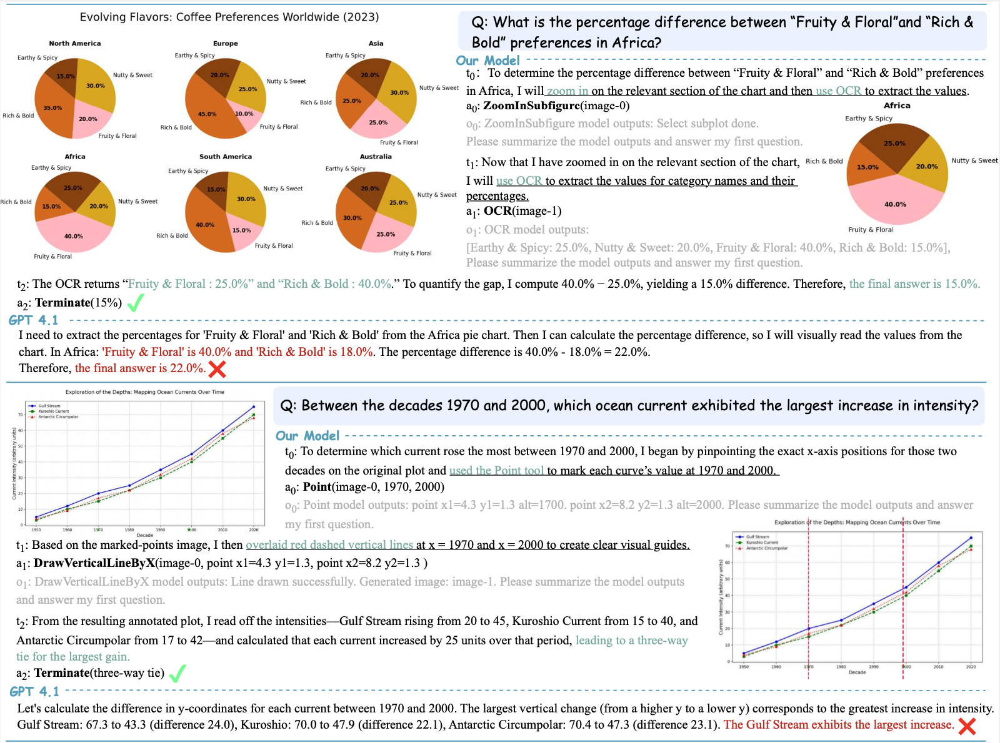

<div align="center">
  
  <h1 align="center">Use Vision Tools, Think with Images</h1>
</div>

[](https://arxiv.org/pdf/2505.08617)  
[](https://github.com/zhaochen0110/OpenThinkIMG)  
[](https://huggingface.co/collections/Elliott/luffy-rl-6804e1f5d1ebe66ba8ac92f4)  
[](https://x.com/suzhaochen0110/status/1922481570453074070?s=46)

## 👁️ Vision: "Thinking with Images"

> *"The eye sees only what the mind is prepared to comprehend."* – Robertson Davies

Humans don't just passively observe; we actively engage with visual information, sketching, highlighting, and manipulating it to understand. OpenThinkIMG aims to bring this interactive visual cognition to AI, enabling agents that can genuinely "think with images."


<div align="center">
  
  <br>
  <em>Overview of the OpenThinkIMG framework and V-ToolRL training process.</em>
</div>

---

## 🤔 What is OpenThinkIMG?

OpenThinkIMG is an end-to-end open-source framework that empowers Large Vision-Language Models (LVLMs) to think with images. It features:
*   Flexible vision tool management and easy integration of new tools.
*   Efficient dynamic inference with distributed tool deployment.
*   A streamlined SFT (Supervised Fine-Tuning) and Agent-RL (Reinforcement Learning) training pipeline, including our novel **V-ToolRL** method.

Our goal is to enable AI agents to interactively use visual tools to decompose, analyze, and solve complex visual problems, moving beyond passive observation towards active visual cognition.

---

## 🐚 Why OpenThinkIMG?

Current LVLMs excel at many tasks but often struggle when:
*   Deep, iterative visual reasoning is required, not just single-pass description.
*   Precise interaction with visual content (e.g., reading specific chart values, identifying exact locations) is crucial.
*   Generalizing learned tool-use to new scenarios dynamically.

OpenThinkIMG addresses these challenges by:

*   **Bridging the Gap to Human-like Visual Cognition**: We enable LVLMs to "think with images" by actively using a suite of visual tools, much like humans use sketches or highlights to understand complex scenes.
*   **Standardizing a Fragmented Landscape**: The current ecosystem for vision tools lacks unification. OpenThinkIMG provides:
    *   **Unified Tool Interfaces**: A standardized way to define and interact with diverse visual tools.
    *   **Modular, Distributed Deployment**: Tools run as independent services, enhancing scalability, fault isolation, and resource management.
*   **Moving Beyond Static SFT Limitations**: Supervised Fine-Tuning (SFT) on fixed trajectories often leads to poor generalization and lacks adaptability. We introduce:
    *   **V-ToolRL for Adaptive Policies**: Our novel reinforcement learning framework allows agents to *autonomously discover optimal tool-usage strategies* by directly optimizing for task success through interaction and feedback. This leads to significantly better performance and adaptability compared to SFT-only approaches.
*   **Driving Reproducible Research**: By open-sourcing the entire framework, we aim to provide a common platform for the community to build upon, experiment with, and advance the field of tool-augmented visual reasoning.

---

## 🚧 Project Status

OpenThinkIMG is currently an **alpha release** but is actively being developed. The core end-to-end system, including tool integration, trajectory generation, SFT (Cold-Start), and V-ToolRL training, is functional and can be used to replicate the results in our paper.

The project team is actively working on the following key milestones:

*   **🥇 Release of Pre-trained Models**: Providing readily usable SFT-initialized and V-ToolRL-trained agent models (e.g., based on Qwen2-VL-2B).
*   **🛠️ Expanding the Vision Toolset**: Integrating more diverse and powerful vision tools (e.g., advanced image editing, 3D analysis tools).
*   **🤖 Broader LVLM Backbone Support**: Adding easy integration for more open-source LVLMs (e.g., LLaVA series, MiniGPT-4).
*   **📊 More Benchmarks & Evaluation Suites**: Extending evaluation to a wider range of visual reasoning tasks beyond chart reasoning.
*   **🌐 Community Building**: Fostering an active community through GitHub discussions, contributions, and collaborations.

We welcome contributions and feedback to help us achieve these goals!

---


## 🔧 Vision Toolset

| **Tool**                    | **Input**                        | **Output**                             | **Description**                                                                                  |
|-----------------------------|----------------------------------|----------------------------------------|--------------------------------------------------------------------------------------------------|
| **GroundingDINO**           | image + text query               | bounding boxes                         | Object detection producing boxes for any target                                                  |
| **SAM**                     | image + bounding box             | segmentation mask                      | Generates precise segmentation masks based on provided regions                    |
| **OCR**                     | image                            | text strings + bounding boxes          | Optical character recognition for extracting text from images                                    |
| **Crop**                    | image + region coordinates       | cropped image                          | Extracts a sub-region of the image for focused analysis                                          |
| **Point**                   | image + target description       | point coordinates                      | Uses a model to predict the location of a specified object                                      |
| **DrawHorizontalLineByY**   | image + Y-coordinate             | annotated image                        | Draws a horizontal line at the given Y-coordinate                                                |
| **DrawVerticalLineByX**     | image + X-coordinate             | annotated image                        | Draws a vertical line at the given X-coordinate                                                  |
| **ZoominSubplot**           | image + description (title/pos)  | subplot images                 | Zoomin subplot(s) based on description                                                         |
| **SegmentRegionAroundPoint**| image + point coordinate         | localized mask                         | Refines segmentation around a specified point                                                    |
> 💡 More vision tools are coming soon!

## 📊 Results on Chart Reasoning (ChartGemma)
Our V-ToolRL approach significantly boosts performance:


| Model                          | Method       | Accuracy (%) |
| :----------------------------- | :----------- | :----------- |
| GPT-4.1       | Zero-shot    | 50.71        |
| Gemini-2.0-flash-exp   | Zero-shot    | 68.20        |
| ---                            | ---          | ---          |
| CogCom                         |  SFT (CoM)    | 15.07        |
| TACO                           | SFT (CoTA)   | 30.50        |
| ---                            | ---          | ---          |
| Qwen2-vl-2B                    | Zero-shot    | 29.56        |
| Qwen2-vl-2B-SFT      | SFT          | 45.67        |
| Text-based RL     | RL (No Vis)  | 51.63        |
| **V-ToolRL**    | **V-ToolRL** | **59.39**    |

V-ToolRL not only enhances our base model by +29.83 points but also outperforms other open-source tool-augmented agents and even strong closed-source models like GPT-4.1.


## ⚙️ Installation

We provide a general setup that works across most tools. Individual tools may have specific requirements (to be released separately).

```bash
# Clone the repository
git clone git@github.com:zhaochen0110/Tool-Factory.git
cd Tool-Factory

# [Optional] Create a clean Conda environment
conda create -n tool-server python=3.10
conda activate tool-server

# Install PyTorch and dependencies (make sure CUDA version matches)
conda install pytorch==2.0.1 torchvision==0.15.2 torchaudio==2.0.2 pytorch-cuda=11.8 -c pytorch -c nvidia

# Install remaining dependencies
pip install -r requirements.txt
pip install -e .
```
> 💡 Note: The `requirements.txt` is tailored for inference & evaluation. For training, refer to the Training Section for additional dependencies.

If you encounter issues, check out our [📄 Documentation](docs/README.md).


## 🚀 Quick Start

### 🔌 Step 1: Launch Vision Tool Services

To enable tool-enhanced inference, start all vision tools before using the inferencer. Each tool runs independently and is launched via a unified config.

```bash
## First, modify the config to adapt to your own environment
## tool_server/tool_workers/scripts/launch_scripts/config/all_service_szc.yaml

## Start all services
cd tool_server/tool_workers/scripts/launch_scripts
python start_server_config.py --config ./config/all_service.yaml

## Press control + C to shutdown all services automatically.
```

### 🔍 Step 2: Run Inference with OpenThinkIMG

#### ✅ Option 1: Direct Evaluation (e.g., Qwen2VL on ChartGemma)

```bash
accelerate launch  --config_file  ${accelerate_config} \
-m tool_server.tf_eval \
--model qwen2vl \
--model_args pretrained=Qwen/Qwen2-VL-7B-Instruct \
--task_name chartgemma \
--verbosity INFO \
--output_path ./tool_server/tf_eval/scripts/logs/results/chartgemma/qwen2vl.jsonl \
--batch_size 2 \
--max_rounds 3 \
--stop_token <stop> 
```

#### 🧩 Option 2: Evaluation via Config File (Recommended)


```bash
accelerate launch  --config_file  ${accelerate_config} \
-m tool_server.tf_eval \
--config ${config_file}
```

#### Config file example:

```yaml
- model_args:
    model: qwen2vl
    model_args: pretrained=Qwen/Qwen2-VL-7B-Instruct
    batch_size: 2
    max_rounds: 3
    stop_token: <stop>
  task_args:
    task_name: chartgemma
    resume_from_ckpt:
      chartgemma: ./tool_server/tf_eval/scripts/logs/ckpt/chartgemma/qwen2vl.jsonl
    save_to_ckpt:
      chartgemma: ./tool_server/tf_eval/scripts/logs/ckpt/chartgemma/qwen2vl.jsonl
  script_args:
    verbosity: INFO
    output_path: ./tool_server/tf_eval/scripts/logs/results/chartgemma/qwen2vl.jsonl
```

For detailed information and config setting please refer to our [documentation](docs/README.md).


## 🧠 Training

Once the vision tools are properly deployed, we provide a flexible training pipeline to teach models **how to plan and invoke tools** effectively through **SFT** and our proposed **V-ToolRL** methods.

Our training pipeline builds on the solid foundation of [OpenR1](https://github.com/OpenR1), integrating visual tools as external reasoning capabilities.

### 📦 Install Additional Dependencies

To run the training code, make sure to install the additional required packages:

```
pip install -r requirements_train.txt
```

### 🔁 V-ToolRL: Reinforcement Learning with Vision Tools

We provide a customized implementation of V-ToolRL for training models to leverage vision tools dynamically in complex tasks.

```
torchrun --nproc_per_node=${nproc_per_node} \
    --nnodes="1" \
    --node_rank="0" \
    --master_addr="127.0.0.1" \
    --master_port=${master_port} \
    src/open_r1/tool_grpo.py --use_vllm True \
    --output_dir ${output_dir} \
    --model_name_or_path ${model_path} \
    --dataset_name ${data_path} \
    --max_prompt_length 16000 \
    --max_completion_length 2048 \
    --temperature 1.0 \
    --seed 42 \
    --learning_rate 1e-6 \
    --num_generations 8 \
    --lr_scheduler_type "constant" \
    --vllm_gpu_memory_utilization 0.8 \
    --deepspeed ${DS_CONFIG} \
    --per_device_train_batch_size 2 \
    --gradient_accumulation_steps 12 \
    --logging_steps 1 \
    --bf16 true \
    --report_to wandb \
    --gradient_checkpointing true \
    --attn_implementation flash_attention_2 \
    --max_pixels 200000 \
    --num_train_epochs 1 \
    --run_name $RUN_NAME \
    --save_steps 100 \
    --save_only_model true \
    --controller_addr http://SH-IDCA1404-10-140-54-15:20001 \
    --use_tool true
```

> 📈  This helps the model learn **dynamic planning & tool invocation** using environment feedback.

### 🧪 SFT: Supervised Fine-Tuning

We also support supervised fine-tuning for training models on curated tool usage demonstrations. Modify the config according to your use case:

```
    accelerate launch --num_machines 1 --num_processes 6 --main_process_port 29502 --multi_gpu\
    src/open_r1/sft.py \
    --output_dir ${output_dir} \
    --model_name_or_path ${model_path} \
    --dataset_name ${data_path} \
    --seed 42 \
    --learning_rate 2e-5 \
    --max_seq_length 4096 \
    --deepspeed config/deepspeed/ds_z3_offload_config.json \
    --per_device_train_batch_size 2 \
    --gradient_accumulation_steps 8 \
    --logging_steps 1 \
    --report_to wandb \
    --gradient_checkpointing true \
    --attn_implementation flash_attention_2 \
    --bf16 \
    --num_train_epochs 2 \
    --run_name $RUN_NAME \
    --save_steps 100 \
    --warmup_ratio 0.1 \
    --save_only_model true
```

## 📂 Case Studies


<div align="center">
  
  <br>
  <em>An example demonstrating the step-by-step visual reasoning process of our V-ToolRL agent.</em>
</div>

## 🤝 Contributing

We welcome contributions of all kinds! In our [Documentation](docs/README.md) you’ll find detailed guides for:

- Importing custom models  
- Defining and integrating new vision tools  
- Extending the training pipeline  

To contribute:

1. **Fork** the repository and create a feature branch (e.g., `feature/new-vision-tool`).  
2. **Implement** your changes, adding or updating tests under `tests/`.  
4. **Submit** a pull request referencing the relevant issue, with clear descriptions and code snippets.  


## 🙏 Acknowledgments

We thank the [Visual Sketchpad](https://arxiv.org/abs/2406.09403) and [TACO](https://arxiv.org/abs/2402.05479) teams for inspiring our vision-driven reasoning paradigm.


## 📖 Citation

Please cite the following if you find OpenThinkIMG helpful:

```
@misc{OpenThinkIMG,
  author       = {OpenThinkIMG Team},
  title        = {OpenThinkIMG: Empowering vision-driven reasoning through modular tool orchestration},
  year         = {2025},
  organization = {GitHub},
  url          = {https://github.com/OpenThinkIMG/OpenThinkIMG},
}
```


